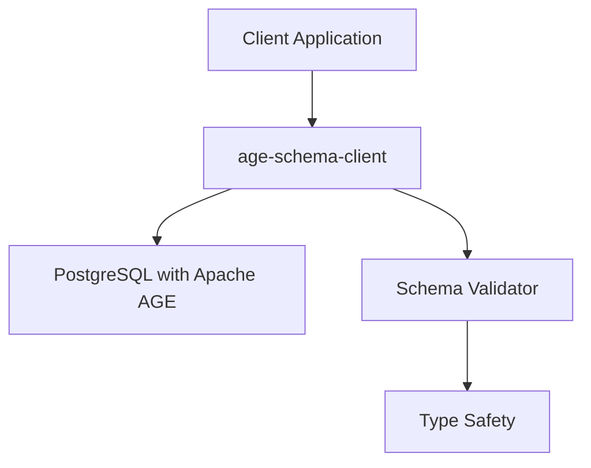

# Documentation Style Guide

This style guide ensures consistency and quality across all Apache AGE Schema Client documentation.

## Writing Style

### Voice and Tone

- **Use active voice**: "Create a vertex" instead of "A vertex is created"
- **Address the reader directly**: Use "you" instead of "the user" or "one"
- **Be conversational but professional**: Friendly and approachable, not overly formal
- **Stay positive**: Focus on what users can do, not what they can't

### Tense and Perspective

- **Use present tense**: "The function returns" not "The function will return"
- **Use imperative mood for instructions**: "Run the command" not "You should run the command"
- **Use second person**: "You can configure" not "Users can configure"

### Sentence Structure

- **Keep sentences concise**: Aim for 15-20 words per sentence
- **Use parallel structure**: "Create, configure, and deploy" not "Create, configuring, and deployment"
- **Avoid unnecessary words**: "To create a vertex" not "In order to create a vertex"
- **Use simple sentence structures**: Prefer simple and compound sentences over complex ones

### Language Guidelines

- **Use inclusive language**: Avoid assumptions about gender, ability, or background
- **Define technical terms**: Either inline or link to a glossary
- **Use consistent terminology**: See [Terminology](#terminology) section
- **Avoid jargon**: When technical terms are necessary, explain them

## Formatting Standards

### Headings

Use sentence case for all headings:

```markdown
# Main page title
## Section heading
### Subsection heading
#### Sub-subsection heading (use sparingly)
```

**Guidelines:**
- Use descriptive, scannable headings
- Avoid skipping heading levels (don't go from H2 to H4)
- Keep headings under 60 characters
- Use parallel structure in heading series

### Lists

**Unordered lists:**
- Use hyphens (`-`) for consistency
- Capitalize the first word of each item
- Use parallel structure (all sentences or all fragments)
- End with periods only if items are complete sentences

**Ordered lists:**
1. Use for sequential steps or ranked items
2. Capitalize the first word of each item
3. Use periods for complete sentences
4. Use parallel structure throughout

### Code Formatting

#### Inline Code

Use backticks for:
- Function names: `createVertex()`
- Variable names: `connectionManager`
- File names: `package.json`
- Short code snippets: `const result = await query()`

#### Code Blocks

Always specify the language for syntax highlighting:

````markdown
```typescript
import { PgConnectionManager } from 'age-schema-client';

const manager = new PgConnectionManager({
  host: 'localhost',
  port: 5432,
  database: 'postgres'
});
```
````

**Code block guidelines:**
- Include language identifier (`typescript`, `javascript`, `sql`, `bash`, etc.)
- Keep examples focused on a single concept
- Include comments for complex operations
- Show expected output where applicable
- Use realistic, working examples

#### Code Example Structure

For comprehensive examples, use this structure:

````markdown
```typescript
// Import required modules
import { PgConnectionManager, QueryExecutor } from 'age-schema-client';

// Configure connection
const connectionManager = new PgConnectionManager({
  host: 'localhost',
  port: 5432,
  database: 'postgres',
  user: 'postgres',
  password: 'postgres'
});

// Create and use connection
const connection = await connectionManager.getConnection();
const queryExecutor = new QueryExecutor(connection);

// Your main example code here
const result = await queryExecutor.executeCypher(
  'MATCH (n:Person) RETURN n LIMIT 5',
  {},
  'demo_graph'
);

console.log('Found persons:', result.rows);

// Clean up
connection.release();
await connectionManager.closeAll();
```
````

### Links

**Internal links:**
- Use relative paths: `[Schema Definition](../schema-definition.md)`
- Include descriptive link text: `[batch loading guide](./batch-operations.md)` not `[here](./batch-operations.md)`

**External links:**
- Open in new tab for external resources: `[Apache AGE](https://age.apache.org/){:target="_blank"}`
- Use HTTPS when available
- Link to official documentation when possible

### Tables

Use tables for structured data comparison:

| Parameter | Type | Required | Description |
|-----------|------|----------|-------------|
| `host` | string | Yes | Database host address |
| `port` | number | No | Database port (default: 5432) |
| `database` | string | Yes | Database name |

**Table guidelines:**
- Use sentence case for headers
- Keep cell content concise
- Align columns consistently
- Include units where applicable

## Content Structure

### Page Organization

Every documentation page should include:

1. **Title**: Clear, descriptive H1 heading
2. **Introduction**: Brief overview of the topic (1-2 paragraphs)
3. **Prerequisites**: What users need before starting (if applicable)
4. **Main content**: Organized with clear headings
5. **Examples**: Practical, working code examples
6. **Related topics**: Links to relevant documentation

### Introduction Pattern

Start each page with a clear introduction:

```markdown
# Batch Operations

The BatchLoader provides efficient methods for loading large volumes of graph data into Apache AGE databases. This guide covers configuration, usage patterns, and performance optimization techniques.

## Prerequisites

Before using the BatchLoader, ensure you have:
- A configured Apache AGE database
- Basic understanding of graph data structures
- Node.js 16+ and the age-schema-client library installed
```

### Example Structure

Organize examples from simple to complex:

1. **Basic example**: Minimal working code
2. **Practical example**: Real-world usage
3. **Advanced example**: Complex scenarios with error handling

## Terminology

Use these terms consistently throughout documentation:

### Apache AGE Terms
- **Graph**: The graph database instance
- **Vertex**: A node in the graph (not "node" to avoid confusion with Node.js)
- **Edge**: A relationship between vertices
- **Label**: The type of a vertex or edge
- **Property**: Key-value data attached to vertices or edges
- **Cypher**: The query language used by Apache AGE

### Library Terms
- **Schema**: The type definition for your graph structure
- **Connection**: Database connection instance
- **Query Executor**: Component that executes queries
- **Batch Loader**: Component for bulk data operations
- **Validator**: Component that validates data against schema

### Technical Terms
- **TypeScript**: Always capitalize both T and S
- **JavaScript**: Always capitalize both J and S
- **PostgreSQL**: Use full name, not "Postgres" in formal documentation
- **API**: Application Programming Interface (spell out on first use)
- **CLI**: Command Line Interface (spell out on first use)

## Diagram Standards

### Mermaid Diagrams

Use Mermaid for technical diagrams:

````markdown

````

**Diagram guidelines:**
- Use consistent colors and shapes
- Keep diagrams simple and focused
- Include descriptive titles
- Use standard flowchart symbols

### Architecture Diagrams

For system architecture:
- Show data flow clearly
- Include all major components
- Use consistent naming
- Add brief explanations

## Error Messages and Warnings

### Error Documentation

When documenting errors:

```markdown
**Error**: `ValidationError: Property 'name' is required`

**Cause**: The vertex data is missing a required property.

**Solution**: Ensure all required properties are included:

```typescript
const vertex = await vertexOperations.createVertex('Person', {
  name: 'John Doe',  // Required property
  email: 'john@example.com'  // Required property
});
```
```

### Warning Callouts

Use consistent callout formatting:

```markdown
> ⚠️ **Warning**: The third parameter of `ag_catalog.cypher()` cannot be parameterized. Always use the temporary table approach for dynamic values.

> 💡 **Tip**: Use batch operations for loading more than 100 vertices or edges at once.

> 📝 **Note**: Schema validation occurs before data is sent to the database.
```

## API Documentation Standards

### Function Documentation

For manual API documentation (complementing TypeDoc):

```markdown
### createVertex()

Creates a new vertex in the graph with the specified label and properties.

**Syntax:**
```typescript
createVertex<T extends VertexLabel>(
  label: T,
  properties: VertexProperties<T>
): Promise<Vertex<T>>
```

**Parameters:**
- `label` (string): The vertex label as defined in your schema
- `properties` (object): The vertex properties matching the schema definition

**Returns:**
Promise that resolves to the created vertex with generated ID.

**Example:**
```typescript
const person = await vertexOperations.createVertex('Person', {
  name: 'Alice Smith',
  age: 30,
  email: 'alice@example.com'
});
```

**Throws:**
- `ValidationError`: When properties don't match the schema
- `DatabaseError`: When the database operation fails
```

### TypeScript Integration

When documenting TypeScript-specific features:

- Show type definitions clearly
- Explain generic type parameters
- Include import statements
- Demonstrate type safety benefits

## Quality Checklist

Before publishing documentation:

- [ ] **Grammar and spelling**: Use spell check and grammar tools
- [ ] **Code examples**: Test all code examples for accuracy
- [ ] **Links**: Verify all internal and external links work
- [ ] **Consistency**: Check terminology and formatting consistency
- [ ] **Accessibility**: Ensure proper heading hierarchy and alt text
- [ ] **Mobile**: Test readability on mobile devices
- [ ] **Search**: Include relevant keywords for searchability

## Tools and Resources

### Writing Tools
- **Grammarly**: For grammar and style checking
- **Hemingway Editor**: For readability improvement
- **Vale**: For automated style guide enforcement

### Testing Tools
- **Link checkers**: Verify all links are working
- **Spell checkers**: Catch typos and misspellings
- **Accessibility checkers**: Ensure inclusive design

### Reference Materials
- **Apache AGE Documentation**: For accurate technical details
- **TypeScript Handbook**: For TypeScript-specific guidance
- **PostgreSQL Documentation**: For database-related content

## Examples of Good Documentation

### Clear Introduction
```markdown
# Schema Validation

Schema validation ensures that your graph data matches the defined structure before it's stored in the database. This prevents runtime errors and maintains data consistency across your application.
```

### Effective Code Example
```typescript
// Define your schema with validation rules
const schema = {
  vertices: {
    Person: {
      properties: {
        name: { type: 'string', minLength: 1 },
        age: { type: 'integer', minimum: 0 },
        email: { type: 'string', format: 'email' }
      },
      required: ['name', 'email']
    }
  }
};

// The validator will check this data automatically
const person = await vertexOperations.createVertex('Person', {
  name: 'John Doe',
  age: 30,
  email: 'john@example.com'  // Valid email format required
});
```

### Helpful Error Documentation
```markdown
**Common Error**: `TypeError: Cannot read property 'createVertex' of undefined`

This error occurs when the vertex operations object hasn't been properly initialized.

**Solution**: Ensure you've created the vertex operations instance:
```typescript
const vertexOperations = new VertexOperations(schema, queryExecutor, sqlGenerator);
```
```

This style guide helps maintain consistency and quality across all documentation. When in doubt, look at existing documentation for examples, and don't hesitate to ask for clarification in your pull request.
